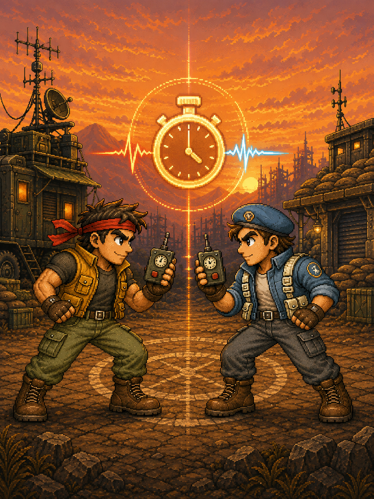

<p align="right">
  <strong>简体中文</strong> · <a href="RELEASE_TIME_CHALLENGE.md">English</a>
</p>

# 《掐秒挑战》发布与分享



## 游戏简介

《掐秒挑战》把一台 AI Passport 变成共享的时间感竞技场。两名玩家看到相同的 1.0～3.0 秒目标后，轮流按 OK 开始和停止，在没有计时显示的情况下全凭感觉估算。误差更小者赢下回合，率先三胜者赢得整场。

本版包含同机双人、AI 练习、成绩封存、独立的回合与整场胜利动画、原创街机音乐、按键反馈和实时电量显示。

## 游玩方式

1. 在硬件菜单选中 Challenge，按 OK 进入。
2. 游戏首页按 UP 切换双人／AI 练习，按 DOWN 开关声音。
3. 按 OK 开始；记住目标时长，按 OK 开始计时，感觉时间到了再按一次 OK。
4. 双人模式下把设备交给第二名玩家；对方按一次 OK 开始，再按一次停止。
5. 双方成绩封存后，按 OK 揭晓胜负；具体结果页会停留，等待再次按 OK。
6. 长按 OK 一秒返回硬件菜单。

## 安装分享固件

请选择合并后的 `FoloToy-AI-Passport-full.bin`，不要使用只含应用区的镜像。

1. 用支持的浏览器打开 [AI Passport 网页刷机工具](https://ai-passport.folotoy.cn/tools/web-flasher/)。
2. 使用 USB 数据线连接 AI Passport。
3. 选择 `FoloToy-AI-Passport-full.bin`，波特率可选 460800，并从地址 `0x0` 开始刷写。
4. 等待写入校验和设备重启完成后，再断开数据线。

合并镜像在身份信息与 Recovery 保护区之前结束，不包含凭据、设备身份或 Recovery 镜像。当前开发板在本项目开始前就缺少已安装的 Recovery；本固件既没有造成、也不会修复该设备自身的既有状态。

## 从源码构建

启用 ESP-IDF 5.5.3 环境后运行：

```bash
./tools/validate.sh
```

完整门禁会执行仓库检查与主机测试、构建应用、校验分区契约和 3 MB 应用上限，并生成可从 `0x0` 刷写的 `build/FoloToy-AI-Passport-full.bin`。

## 社区发布资料

- 应用名：`time-challenge`
- 中文标题：《掐秒挑战》
- 英文标题：`Time Challenge`
- 封面：`assets/images/time-duel/time-challenge-cover.png`
- 固件：`build/FoloToy-AI-Passport-full.bin`
- 源码分支：`feature/time-duel`；目前尚未配置公开 fork 地址

中文简介：把 AI Passport 变成双人时间感竞技场。两名玩家共用一台设备，看到目标时长后轮流按 OK 开始和停止，全凭感觉掐秒；误差更小者赢下回合，率先三胜赢得整场。包含 AI 练习、独立的回合／整场动画、原创街机音乐和按键反馈。

英文简介：Turn one AI Passport into a two-player time-sense showdown. Share the device, remember the target, then press OK to start and stop entirely by feel. The closer estimate wins each round, and the first to three takes the match. Includes AI practice, separate round and match celebrations, original arcade music, and responsive button cues.

社区上传还要求刚刚通过串口获取的真实屏幕画面及配套凭据。预览和校验只是安全准备；只有创作者确认全部字段后，才会正式上传。
